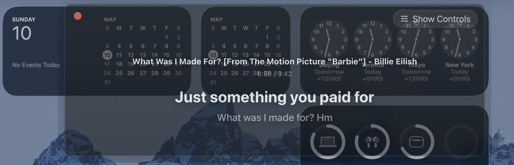
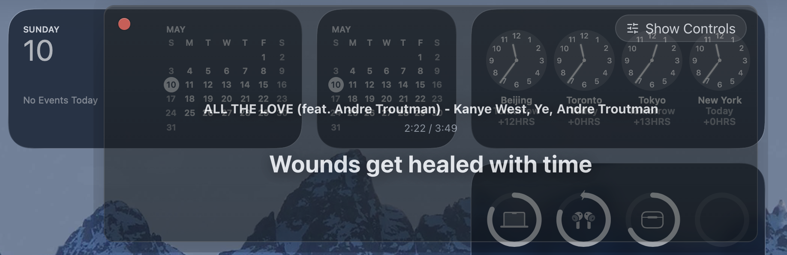
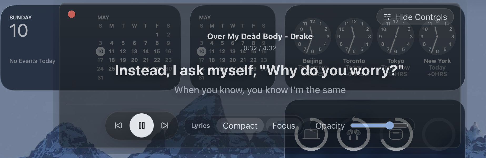

# FloatLyrics

FloatLyrics is a macOS desktop app that shows synced lyrics in a transparent, always-on-top overlay while Spotify plays in the background.

This project is currently built for macOS only.

> Early prototype: FloatLyrics is macOS-only. If a DMG is not available in Releases yet, you can build it locally from the project folder.

## Overview

FloatLyrics is an Electron desktop overlay for Spotify listeners. It connects to Spotify using Authorization Code Flow with PKCE, reads the current playback state, fetches synced LRC lyrics, and displays the current and next lyric line in a compact floating window.

The app is intentionally minimal: no full player UI, no playlists, and no account management. The main goal is a clean lyrics overlay that stays out of the way.

## Features

- Transparent, frameless macOS lyrics overlay
- Always-on-top window
- Spotify login with Authorization Code Flow + PKCE
- Current Spotify track detection
- Synced lyric lookup and timestamp parsing
- Compact mode: current line + next line
- Focus mode: current line only
- Opacity control
- Spotify playback controls for previous, play/pause, and next
- `Cmd+Shift+L` shortcut to show or hide the overlay
- Native macOS Spotify control support through AppleScript

## Tech Stack

- Electron
- React
- TypeScript
- Vite
- Spotify Web API
- LRCLIB synced lyrics API
- lucide-react icons

## Screenshots

### Compact Mode



### Focus Mode



### Controls



## Installation

### Download the macOS App

If a release is available:

1. Open the [FloatLyrics Releases page](https://github.com/jasonnn404/FloatLyrics/releases).
2. Download the latest `.dmg`.
3. Open the `.dmg`.
4. Drag `FloatLyrics` into `Applications`.
5. Open FloatLyrics.

If macOS warns that the app cannot be opened because it is from an unidentified developer, right-click the app and choose `Open`.

Current local builds are unsigned and not notarized. A signed macOS release is planned.

### Simple Setup

1. Install [Node.js](https://nodejs.org/) if you do not already have it.
2. Download this project from GitHub:
   - Click the green `Code` button.
   - Click `Download ZIP`.
   - Unzip the folder.
3. Open the macOS Terminal app.
4. Drag the unzipped FloatLyrics folder into the Terminal window after typing `cd `.

It should look something like this:

```bash
cd /Users/yourname/Downloads/FloatLyrics
```

5. Press Enter, then install the app dependencies:

```bash
npm install
```

If you are comfortable with Git, you can clone instead:

```bash
git clone https://github.com/jasonnn404/FloatLyrics.git
cd FloatLyrics
npm install
```

## Spotify Setup

FloatLyrics needs a Spotify Client ID so Spotify knows which local app is asking for playback access. You do not need a client secret.

1. Go to the [Spotify Developer Dashboard](https://developer.spotify.com/dashboard).
2. Log in with your Spotify account.
3. Click `Create app`.
4. Use any name and description, for example:
   - App name: `FloatLyrics`
   - Description: `Local lyrics overlay`
5. For Redirect URI, add this exactly:

```text
http://127.0.0.1:5173/callback
```

6. Save the Spotify app.
7. Open the app settings and copy the `Client ID`.

FloatLyrics uses PKCE, so it does not need a client secret.

Required scopes:

- `user-read-currently-playing`
- `user-read-playback-state`
- `user-modify-playback-state`

## Environment Variables

In the FloatLyrics folder, create a file named `.env`.

Paste this inside it, replacing `your_spotify_client_id` with the Client ID you copied from Spotify:

```bash
VITE_SPOTIFY_CLIENT_ID=your_spotify_client_id
```

Do not commit `.env`.

If you are using Terminal, you can create the file like this:

```bash
echo 'VITE_SPOTIFY_CLIENT_ID=your_spotify_client_id' > .env
```

Then open `.env` and replace `your_spotify_client_id` with your real Spotify Client ID.

## Development

Start FloatLyrics:

```bash
npm run dev
```

When the app opens:

1. Click `Login with Spotify`.
2. Approve the Spotify permissions.
3. Start playing a song in Spotify.
4. FloatLyrics should show the synced lyrics overlay.

To quit the app, click the red close button in the overlay.

### Developer Commands

Run type checking:

```bash
npm run typecheck
```

Build the app:

```bash
npm run build
```

Build a macOS DMG installer:

```bash
npm run dist:mac
```

The generated `.dmg` will be in the `release/` folder.

On Apple Silicon, this creates:

- `release/FloatLyrics-0.1.0-arm64.dmg`
- `release/FloatLyrics-0.1.0-x64.dmg`

Run the built app locally:

```bash
npm run start
```

Note: the red close button quits the Electron app. The `predev` script also clears this project's stale Vite process on port `5173` before starting.

## Roadmap

- Package FloatLyrics as a signed macOS app
- Publish downloadable GitHub Releases
- Add saved user preferences for opacity and display mode
- Improve lyric lookup matching for remasters, deluxe albums, and alternate titles
- Add a small menu bar item
- Add automatic update support
- Add better error states for unavailable Spotify playback devices
